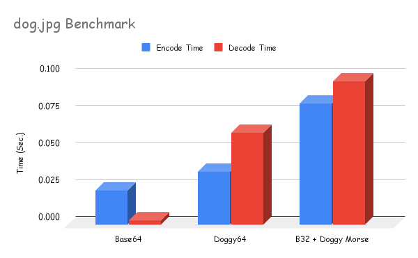
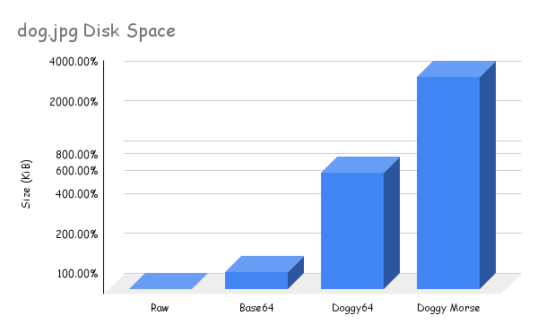

# Doggy64 🐶


 This program can encode arbitrary text or data into a series of doggy sounds

 For example, "Hello world!" becomes:
 
 > howl arrrrf blat moan rrrr arrrrf yarf grrr rrrrr chew yarr sniffle rrrr arrrrf yaff grr
 
This works by mapping the base64 character set to a number of dog noises.

# Why Doggy64?

A massive generational step forward in dog-based encoding technology, Doggy64 boasts massive improvements over its predecessor, [doggymorse](https://github.com/Trainraider/doggymorse).

## Versatility 🪛
While doggymorse could only encode text, and wasn't case sensitive, doggy64 can encode any arbitrary **data, images, video, web-traffic, your diary**, you name it!

## Blazing Fast 🔥
Encode and decode massive files like the 12 kiB sample image [dog.jpg](./sample_files/dog.jpg) in mere fractions of a second! We used **ALGORITHMS** and **AI** to ensure **enterprise-grade SCALABILITY**. Never let performance hold you back.



## Space Efficiency 💾
Using state-of-the-art encoding **ALGORITHMS** we've reduced the space requirements from doggymorse to use **up to 81% LESS SPACE**. This allows you to store more data, images, etc., and stream more videos, while **reducing** your business's **CLOUD costs** and **SAAS overhead**.



# Usage

 ```
$ doggy64 -h
usage: doggy64 [-h] (-e | -d) [-l | -L] [-f INPUT_FILE] [-o OUTPUT_FILE] [input]

Doggy64 encoder/decoder

positional arguments:
  input                 Input data to work with

options:
  -h, --help            show this help message and exit
  -e, --encode          Encode data with Doggy64
  -d, --decode          Decode Doggy64 data
  -l, --line-ending     Include a final line ending
  -L, --no-line-ending  Do not include a final line ending
  -f INPUT_FILE, --file INPUT_FILE
                        Input file to work with
  -o OUTPUT_FILE, --output OUTPUT_FILE
                        Output file to write result to

$ doggy64 -e "Hello"
howl arrrrf blat moan rrrr arrrrf yarf

$ doggymorse -d "howl arrrrf blat moan rrrr arrrrf yarf"
Hello

$ echo "Hello" | doggy64 -d
howl arrrrf blat moan rrrr arrrrf yarf

$ doggy64 -ef dog.jpg -o dog.jpg.doggy64
 ```

### Unix, Linux, MacOS, etc.

 The doggy64 source file is ready to be run as a script directly on any Unix-like system with python installed and python3 in the PATH. You may need to `chmod +x doggy64` if it doesn't have permission to execute however.

### Windows

Install python 3 and make sure it is in your path. Open a terminal like cmd and enter the src folder. Run `python doggy64 -e "Hello"` for example.

# Licencing
Available under GPL 2.0. Contact sales for a commercial license.
